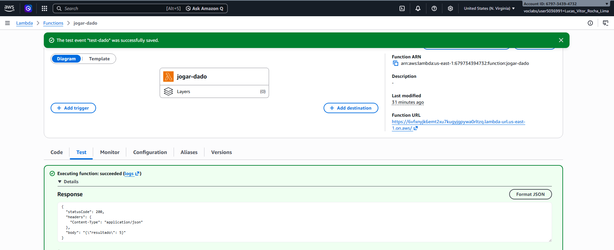
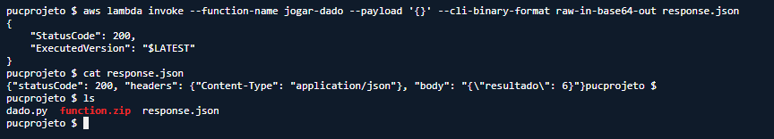

# Checkpoint 1 - Função Serverless na Nuvem

Este projeto contém uma função serverless simples, escrita em Python, que responde a requisições HTTP e foi implantada em ambiente de nuvem.

## Provedor Utilizado

* AWS (Lambda + Function URL)

## Sobre a função

A função (`dado.py`) simula o lançamento de um dado, sorteando um número entre 1 e 6, e retorna o resultado em formato JSON via HTTP.

## Como rodar/testar localmente

### Pré-requisitos

* Python 3.12 instalado
* AWS CLI instalado e configurado (`aws configure`)
* Terminal de comandos aberto

### Passo a passo

1. Clone o repositório:

git clone https://github.com/LucasVitor03/jogar-dado-lambda

2. Entre na pasta do projeto:

cd pucprojeto

## Na AWS

### 1. Empacotar o código

zip -j function.zip dado.py

### 2. Criar a função Lambda

aws lambda create-function
--function-name jogar-dado
--runtime python3.12
--handler dado.handler
--zip-file fileb://function.zip
--role <ARN_DA_ROLE>

### 3. Criar a Function URL (endpoint HTTP público)

aws lambda create-function-url-config
--function-name jogar-dado
--auth-type AWS_IAM

### 4. Dar permissão de invocação

aws lambda add-permission
--function-name jogar-dado
--statement-id AllowMyUserInvoke
--action lambda:InvokeFunctionUrl
--principal "<SEU_ARN>"
--function-url-auth-type AWS_IAM

## Como testar a função já implantada

**Via Console AWS:** 

Lambda → Functions → `jogar-dado` → aba Test → Create new event → Test

**Via CLI (invoke direto):**

aws lambda invoke --function-name jogar-dado --payload '{}'
--cli-binary-format raw-in-base64-out response.json
cat response.json

**Resposta esperada:**
```json
{"resultado": 4}
```

## Prints da implantação




## Observações técnicas

* Foi usado **Function URL** ao invés de API Gateway, por ser uma única função sem necessidade de múltiplas rotas.
* A autenticação é **AWS_IAM** (não pública/anônima) porque o ambiente de laboratório usado (AWS Academy/Vocareum) bloqueia acesso público anônimo por política de organização, mesmo com a permissão de recurso liberada.
